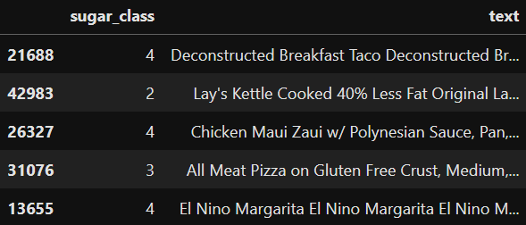
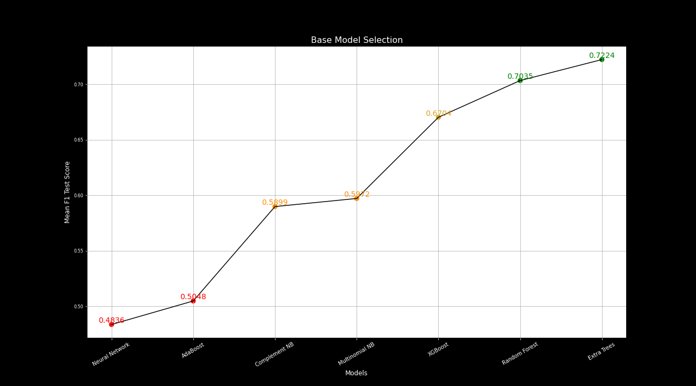
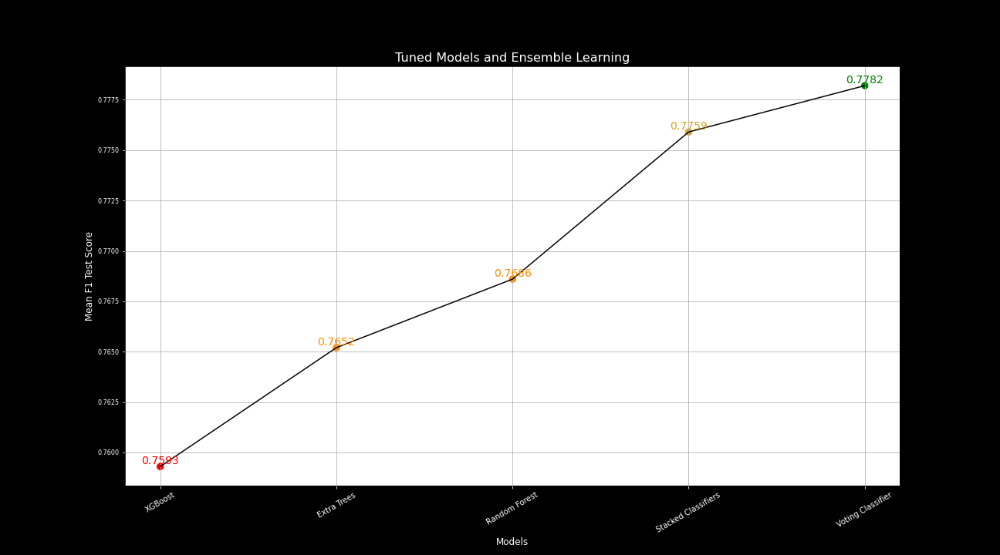
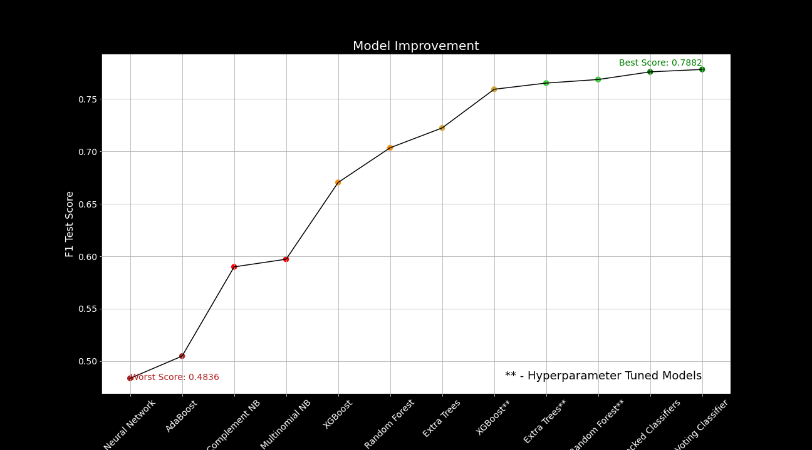
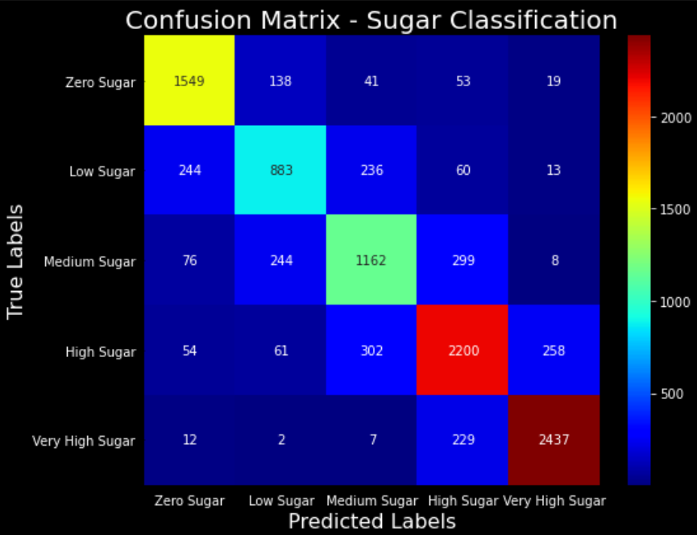

#### **Sugar Classification Using Menu Descriptions**

### **Repository Navigation**

The structure of this repository is straight-forward.  The raw data file as well as the polished data file (explained in the Data Preparation section) are contained in the [Data folder](https://github.com/mastergrumpus/restaurant_prediction/tree/main/Data).  Images used in this README and the Powerpoint presentation are saved in the [Images folder](https://github.com/mastergrumpus/restaurant_prediction/tree/main/Images).

The notebooks can be read in the following order:

1.  eda.ipynb - Contains early EDA, data cleaning, and re-saving as a polished dataset
2.  tuning_and_testing.ipynb - Contains the bulk of the work done to improve the F1 score of the models and includes models that aren't used in the final version as well as RandomizedSearchCVs to perform hyperparameter tuning.
2(a).  neural_network.ipynb - This notebook is experimental and is unfinished.  A simple network did not perform better than my other models but has the potential to do so if further experimentation is done.
3.  final_models.ipynb - This is where the models are finalized and the ensemble methods are performed to bring the best functioning models together.  This notebook also includes visualizations, code, and markdown to evaluate each model's performance and how each step affected the project's performance.

### **Business Problem**

Have you ever been on a diet and been invited out to dinner or wanted take-out?  It can be frustrating to lose track of nutritional intake when eating at a restaurant and you stand the risk of unwittingly ordering something that is unhealthy or outside of your diet's restrictions.

Some menus will provide calorie counts, but that is only helpful for weight gain/loss and does not take into account other health concerns such as diabetes and some forms of heart disease.  What can you do when the only information you have is the title of a dish, short description, and a price?

### **Project Outline and Goal**

My project builds a supervised machine learning model that can predict the sugar content of a menu item.  This model will be able to read the text-based information printed on a menu and make a prediction that can allow you to make an informed decision.

### **The Data**

The data for this project was collected by the Department of Health and Mental Hygiene (DOHMH) and is available to the public from the NYC OpenData website.  The .csv contains over 60,000 menu items available at chain restaurants throughout New York City.  All data was collected between 2017-2018 and was made public on 5/10/2018.  For more information or to download, visit [NYC OpenData's webpage for this dataset](https://data.cityofnewyork.us/Health/DOHMH-MenuStat-Historical-/qgc5-ecnb/about_data)

The menus contained within my data are large chains with one or more franchises within New York City borders.  Overall, there were 86 restaurants represented with a combined total of 65,219 menu items.  Each menu item had information on the restaurant, menu text, food category, serving size, and nutrition facts such as calories, sugar, fats, sodium, and more.

There were several menu items with missing information on Sugar, our target variable.  I felt it was best not to impute the data, as it could give skewed information for model training that could affect accuracy later on.  After removing those items, there remained 52,931 menu items to begin our project.

Below are the top 15 restaurants with the most menu items represented in our data set:

### **Data Prepartaion**

In order to properly train the classification model, the text needed to be combined into a single corpus that could be associated with a sugar class.  This required a few steps:

    Feature Selection
    Deal with Missing Data
    Bin Sugar Contents
    Explore/Understand Data
    Prepare Text
    Save to .csv

**Feature selection** (prior to vectorization) - In this step, I simply eliminated unnecessary data and combined the relevant text columns to create a single column of corpora that could be used as an independent variable.

**Missing Data** - There were several rows throughout the dataset with various parts of nutrition facts omitted. In this case, there were 12,288 items with missing sugar values.  I decided it was best to remove these rows. Although more data will always be helpful, especially for supervised learning models, I didn't want to impute the data and have various word tokens lose or gain inappropriate levels of significance. Ultimately, this left me with 52,931 rows with the data I needed.

**Binning Sugar Contents** - I binned the sugar values into 5 categories according to the quartiles represented in the data with a 5th added category for menu items with 0g sugar.  These quartiles were conveniently in accordance with recommended sugar intake.

1.  Very High Sugar (5) - Menu items with greater than 30g sugar
2.  High Sugar (4) - Menu items with between 7 and 30 grams of sugar
3.  Medium Sugar (3) - Menu items with between 2 and 7 grams of sugar
4.  Low Sugar (2) - Menu items with between 0 and 2 grams of sugar
5.  Zero Sugar (1) - Menu items with exactly 0g sugar

**Data Exploration** - During this step, I took a quick look at the data that I had and got a bigger picture idea of what limitations and specializations this specific dataset might bring to this project.  In particular, I looked at which restaurants were largely represented by examining how many menu items came from each.  Starbucks, Wawa, and Dunkin' Donuts were the largest contributors.  This means that we are going to have lots of data on words like "whipped", "caramel", "mocha", and "chocolate".  Although this is not necessarily problematic, it is worth noting and something I will address in my conclusion's "Next Steps" findings.

**Prepare Text** - To prepare the text, I combined the strings together and removed the restaurant names from the text. It is important to note that some words will appear multiple times in each text block. This will be addressed in my imported Preprocessor class that can be found in the preprocessor_class.py file in the repo. However, it does help form the raw text block that makes up the independent variable.

**Save to .csv** - Finally, I saved the polished dataset to a new .csv.  Since I created multiple notebooks that each would be referencing this data, I wanted to create a designated file in the repository so that I wouldn't need to perform the above steps in each notebook.

I've displayed a sample of this "polished" data below:

### **Pre-Processing Text**

Since I would be using a custom preprocessor multiple times, I created a .py file with code for a preprocessor class that I imported in each notebook.

The class contained a fit() and transform() method as well as a stem_doc() method that would be used in the transformation.  This method performed a few steps:

1.  Remove special characters and numbers, leaving only english letters
2.  Converted all letters to lower-case
3.  Tokenized document to create a bag of word tokens
4.  Removed stopword tokens such as "the", "and", and "to"
5.  Stemmed words to help certain tokens with the same meaning match

### **Modeling**

The initial models are outlined in the tuning_and_testing.ipynb notebook.  There is also an experimental neural network contained in the neural_network.ipynb notebook.  The models I tested were:

1.  Neural Network (Sequential, Dense)
2.  Naive-Bayes (Multinomial and Complement)
3.  AdaBoost
4.  XGBoost
5.  Random Forest Classifier
6.  Extra Trees Classifier

By instantiating and fitting each model, I got a good idea of which models were best suited to the task at hand.  XGBoost, Random Forest Classifier, and Extra Trees Classifier performed best so those were the three I chose to work with.

After testing baseline models, I ran RandomizedSearchCVs for multiple hyperparameter values for XGBoost and Random Forest Classifiers.  This step took the longest due to the long runtimes and I had to create a shortened version of the data to test with.  This produced good results to start with, but Random Forest Classifier in particular required a bit of tweaking to the hyperparameters once the full dataset was introduced.

#### **Evaluation**

I used F1 score as the primary metric to evaluate my models.  I came to this decision because F1 score is:

1.  Resistant to class imbalance.  The class imbalance wasn't severe here, but it was noticeable and it was also possible that some classes would have more data to train on by nature of having more diverse or a higher quantity of text.
2.  Interpretable.  The consequences of false positives and false negatives here aren't particularly important.  While the goal is to be as accurate as possible, I didn't think it was important to place greater concern with one or the other.  In addition, this is a multiclass problem so false negatives and false positives can also have many different meanings.
3.  Helpful for model selection.  Because each model will have its advantages and disadvantages, I wanted a metric that wouldn't favor one or the other.  Using F1 (a function of precision and recall) also guards against outlier representation of one model over another, in the case that, even after iteration, a model performs much better or worse than it should.

My main concern was making sure I was getting a full picture of how each model performed.  Because of that, I also examined log loss as a secondary metric.  I chose log loss because:

1.  It takes class probabilities into account, not just the predicted class labels.  Because this is a multiclass problem, I wanted a secondary metric that could address the fact that there were multiple combinations of predicted and true class labels.
2.  Log loss penalizes consistently incorrect labeling.  Due to the nature of NLP and multiclass classification learning, there is always a possibility of certain language being incorrectly associated with a particular class in a way that it is seen as a strong connection.  Because the data I used is from particular restaurants, I wanted to be cautious.
3.   It is differentiable.  Since I was testing gradient boosting models, I wanted a metric that is less linear and more suited for that method of learning.

In the functions.py file, you can find the code I used to define an evaluate_model() function, which created predictions using test and train sets, calculated F1 scores and log loss, and printed the results.

The results of the base models can be seen below:

### **Ensemble Methods**

After tuning and fitting the best models, the last step was to ensure that the shortcomings of each model were mitigated.  To do so, I used Voting Classifier and Stacking Classifier.

Voting Classifier is exactly as it sounds.  I had 3 models, and each model would make a prediction using its own method.  By defining all 3 models within a Voting Classifier, each model would "vote" on a prediction, with the majority winning.  This means that if XGBoost had a particular problem in its training that caused it to perform poorly on a particular prediction, there was a stronger chance for that to be recognized and for the other models to "overrule" the incorrect classification.

Stacking Classifier works a bit differently but is used for the same reason.  Stacking Classifier uses the predictions of each model in an iterative fashion as it fits on the training data.  Since each model performed relatively well, a Stacking Classifier might be able to recognize an anomaly in another model as such by understanding that the results of a particular prediction were in contrast to other models.

The results of the ensemble methods vs. the finalized, tuned models can be seen below:

#### **Conclusion**

After all of the above steps were completed, the final model is the Voting Classifier, made up of Random Forest Classifier, Extra Trees Classifier, and XGBoost.

Overall, the project ranged in score from 0.4836 to 0.7882.  Given that the dataset is relatively small for the purposes of this project and that there were 5 classes overall, I am satisfied with the scores.  The top visualization shows the growth of the project as I took each step outlined in this write-up.  Below that visualization is a confusion matrix.  This graphic reveals something interesting - that my model does much better on classifications with very high sugar content and those with lower sugar.  It can also be noticed that many incorrect predictions are "close" - often being just 1 class away.

The models make a lot of strong predictions.  However, I have several ideas on how the project could be improved.

**Next Steps**

**More Data**
    As with almost all supervised learning models, more data will be the first priority when looking to improve results.  In my business understanding, I did notice that the data was skewed towards chains with coffee and small snacks such as Starbucks and Dunkin Donuts.  Because of this, the model might make good predictions on words like "creamer", "chocolate", or "latte".  However, this is at the cost of not having as much data on words like "shrimp", "gravy", or "grilled".  Ideally, I would like to find more restaurant menus with nutrition facts to add.

    In addition, all of the data is from chain restaurants.  These foods are more highly processed, contain marketing buzzwords, and represent singular cuisines and food categories.  Smaller restaurants, catering companies, and even airlines, hotels, and other hospitality businesses would provide a more diverse set of data to use.

**Neural Network**
    A neural network was an idea that I tested but didn't choose to focus my time on.  The bagging and boosting models were performing well and I wanted to make sure I used the time allotted (3 weeks) to improve the scores as much as possible.  Since the other models provided the best chance for that, I left neural networks for another day.

    That being said, I'd like to re-visit the idea and I did keep the initial network in the repository so I can return to it.  Due to the nature of a multiclass classification with a high number of features, a complex neural network may be best suited to the task.  Initial testing didn't provide strong results, but I think given enough testing, a neural network as the potential to do better than the other models.

**Re-Visiting Text Processing**

    The tokenization and pre-processing steps used in the project, although standard for NLP processing, don't fully capture the significance of the language involved.  With more time, I'd like to examine bigrams and ensure that the tokens used are not being mixed with tokens with different meanings.  The latter of the two may need to be done manually, but a closer look at the word tokens may reveal some insight into how the processing could be improved.

**Further Tuning**

    The hyperparameter tuning done in the tuning_and_testing.ipynb notebook laid the groundwork for my final model and made some great steps in improving the final model's accuracy.  However, it was interesting to see how the RandomizedSearchCV using a subset had some different results than when the model was fit with the full dataset.  This signifies to me that there is more potential for better results.  Since cross-validation, iteration, and ensemble methods are long processes, it would be worth investigating to ensure that the parameters used in the final model were true maximums and not just local maximums.

### **Thank you all for reading!**

I appreciate you taking the time to look at my project.  If you have any questions, please feel free to email me at normcjen3@gmail.com or find me on LinkedIn at https://www.linkedin.com/in/normanjen/.  I love to discuss data and Machine Learning, so I'd love to hear from you!