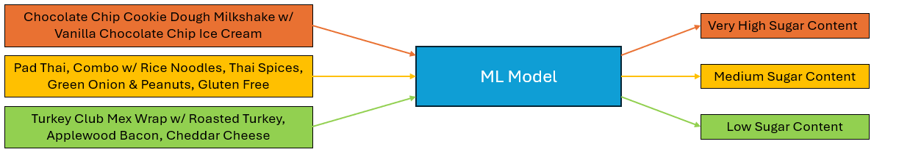
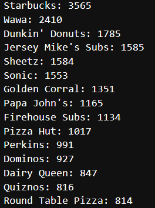
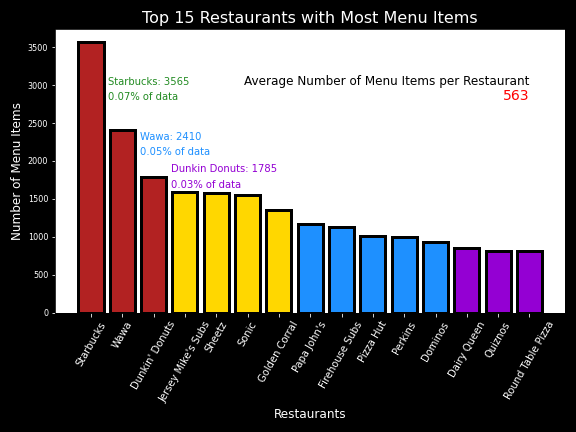

#### **Sugar Classification Using Menu Descriptions**

### **Business Problem**

Have you ever been on a diet and been invited out to dinner or wanted take-out?  It can be frustrating to lose track of nutritional intake when eating at a restaurant and you stand the risk of unwittingly ordering something that is unhealthy or outside of your diet's restrictions.

Some menus will provide calorie counts, but that is only helpful for weight gain/loss and does not take into account other health concerns such as diabetes and some forms of heart disease.  What can you do when the only information you have is the title of a dish, short description, and a price?

### **Project Outline and Goal

My project builds a supervised machine learning model that can predict the sugar content of a menu item.  This model will be able to read the text-based information printed on a menu and make a prediction that can allow you to make an informed decision.

### The Data

The data for this project was collected by the Department of Health and Mental Hygiene (DOHMH) and is available to the public from the NYC OpenData website.  The .csv contains over 60,000 menu items available at chain restaurants throughout New York City.  All data was collected between 2017-2018 and was made public on 5/10/2018.  For more information or to download, visit [NYC OpenData's webpage for this dataset](https://data.cityofnewyork.us/Health/DOHMH-MenuStat-Historical-/qgc5-ecnb/about_data)

The menus contained within my data are large chains with one or more franchises within New York City borders.  Overall, there were 86 restaurants represented with a combined total of 65,219 menu items.  Each menu item had information on the restaurant, menu text, food category, serving size, and nutrition facts such as calories, sugar, fats, sodium, and more.

There were several menu items with missing information on Sugar, our target variable.  I felt it was best not to impute the data, as it could give skewed information for model training that could affect accuracy later on.  After removing those items, there remained 52,931 menu items to begin our project.

Below are the top 15 restaurants with the most menu items represented in our data set:

